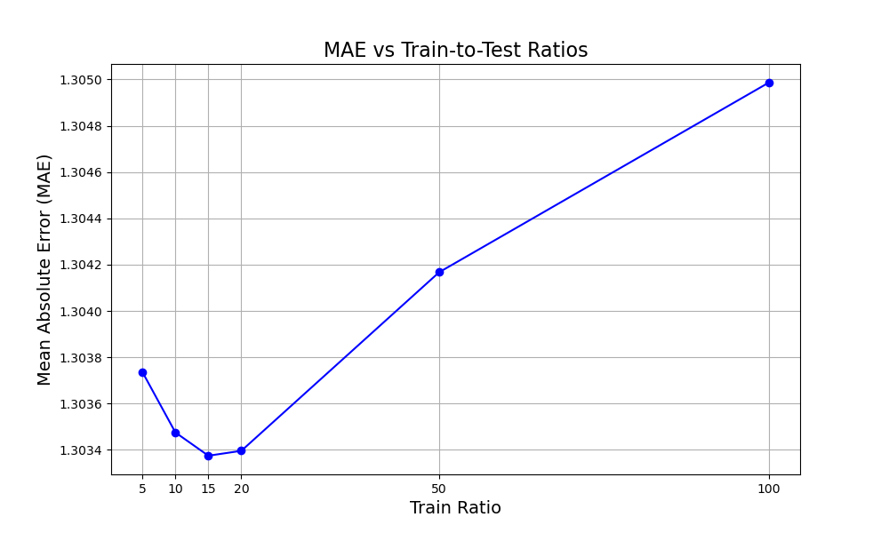
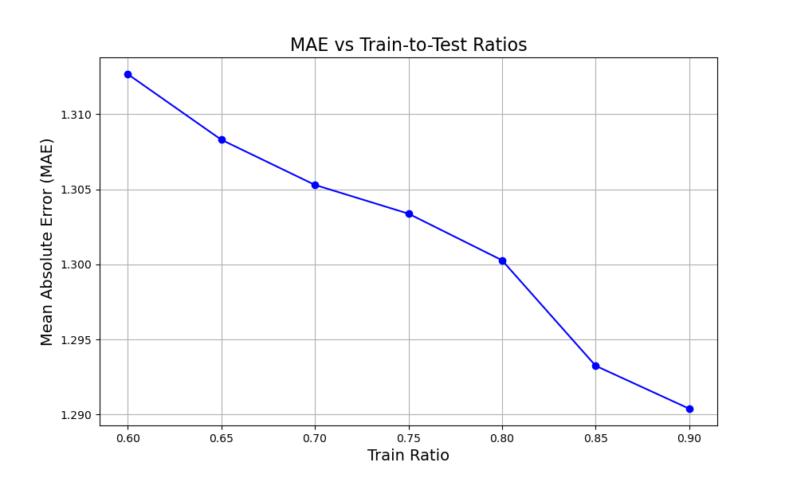

# Book Rating Prediction using Collaborative Filtering

This project builds a memory-based **item-item collaborative filtering** recommender system to predict book ratings. Using a large, sparse dataset of user-book ratings, we compute item similarity using cosine distance and evaluate predictions using **Mean Absolute Difference (MAD)**.

---

## Project Structure

```bash
book-rating-prediction/
│
├── data/                  # Raw CSV files: Books.csv, Users.csv, Ratings.csv
├── notebooks/             # Jupyter notebooks (EDA, experiments)
├── src/                   # Source code modules
│   ├── data_loader.py         # Data loading and preprocessing
│   ├── data_splitter.py       # Train/test splitting
│   ├── similarity.py          # Item-user similarity computation
│   ├── predictor.py           # Rating prediction logic
│   └── evaluation.py          # Evaluation metrics (MAD)
├── experiments/           # Batch experiments for k-values and train ratios
├── results/               # Stores plots and MAE logs
├── main.py                # CLI entry point: runs full pipeline
├── requirements.txt
└── README.md              # You're here!
```

---

## Key Features

- **Explicit Rating Filter**: Only considers ratings > 0 to avoid noise.
- **Sparse Matrix Encoding**: Efficiently stores 433k+ ratings for 77k users × 185k books.
- **Top-k Similarity Search**: Retains top-k most similar items using cosine similarity.
- **Prediction Logic**:
  - Weighted average of user’s ratings on similar items.
  - Fallback to user mean or global mean if no overlap exists.
- **Evaluation Metrics**:
  - Mean Absolute Difference (MAD) across test set.
  - MAE plotted over different values of `k` and train-test ratios.

---

## Results Snapshot

| top_k | MAD (k=10) |
|-------|------------|
| 5     | 1.3037     |
| 10    | 1.3035     |
| 15    | 1.3034     |
| 20    | 1.3034     |
| 50    | 1.3042     |
| 100   | 1.3050     |

Best performing value: `top_k = 15`



| Sample ratio | MAD (k=10) |
|-------|------------|
| 60    | 1.3127     |
| 65    | 1.3083     |
| 70    | 1.3053     |
| 75    | 1.3034     |
| 80    | 1.3003     |
| 85    | 1.2932     |
| 90    | 1.2904     |



---

## How to Run

1. **Install dependencies**

```bash
pip install -r requirements.txt
```

2. **Run the pipeline**

```bash
python main.py
```

This will:
- Load and preprocess data
- Construct the sparse user-item matrix
- Split into train/test sets
- Compute item-item similarity
- Predict and evaluate using MAD
- Plot performance metrics

---

## Feature Representation
Although the core model is based on item-item collaborative filtering (which uses only the sparse user-item rating matrix), I explored the metadata provided for both books and users:

- Book features: Book-Title, Book-Author, Year-Of-Publication, Publisher

- User features: Location, Age

While these features were not directly used in the similarity-based CF model, they could be leveraged in the following ways:

- Content-based filtering: Embedding book titles/authors using TF-IDF or BERT

- Cold-start handling: Using user age or location to estimate preferences

- Hybrid systems: Combining CF-based similarity with metadata similarity

Additionally, I cleaned the Age feature (e.g., removed outliers, filled missing with median) and analyzed the distribution of publication years for books.

These features were retained in the dataset and could be used for future enhancements or hybrid recommendations.

---

## Limitations & Future Work

- Cold-start users/items remain challenging due to lack of rating history.
- Only collaborative signals are used — no metadata (genre, author, age).
- FAISS was considered but skipped due to sparse format limitations.

---

## Dataset Info

From the [Book-Crossing Dataset](http://www2.informatik.uni-freiburg.de/~cziegler/BX/):
- `Books.csv`: ~271k books
- `Users.csv`: ~278k users
- `Ratings.csv`: ~1.15M ratings

After filtering for explicit ratings:
- Final matrix: 77,805 users × 185,973 books with 433,671 ratings
